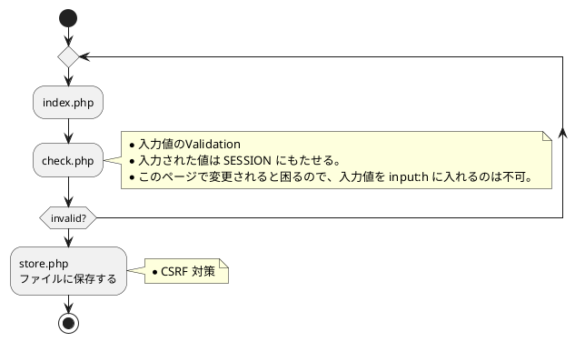

nejimawaso 氏の記事[『PHPでフォームに入力された文字をテキストファイルに書き込む』](https://qiita.com/nejimawaso/items/dc11f75bafcb817f1fd3)のコードをみて、自分ならここまでやるっていうのをやってみた。

## 制限事項

以下のものは、使用できないものとする。

- SESSION
- COOKIE
- DB
- デフォルトでバンドルされていない PHP エクステンション
- 外部ライブラリ（フルスクラッチで書く）

上記に加え、自身に課す制限事項は、以下の通り

- [OWASP top10](https://www.owasp.org/index.php/Category:OWASP_Top_Ten_Project)の事項
- [安全な Web サイトの作り方](https://www.ipa.go.jp/security/vuln/websecurity.html) の事項

つまり、

- 正しい XSS 対策
- CSRF 対策
- Injection 対策（余地あるかな？）
- 変な値をちゃんと弾く

あたりをちゃんと意識する。

## 画面遷移

